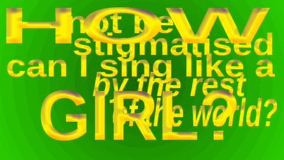
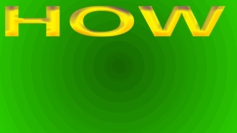
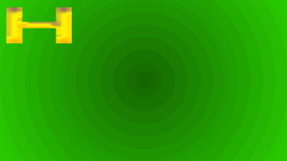
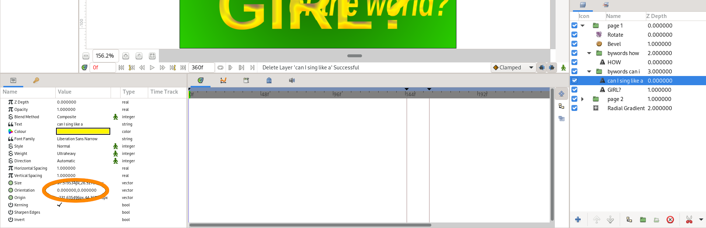
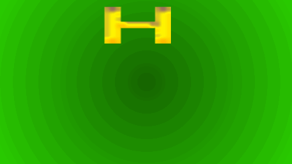
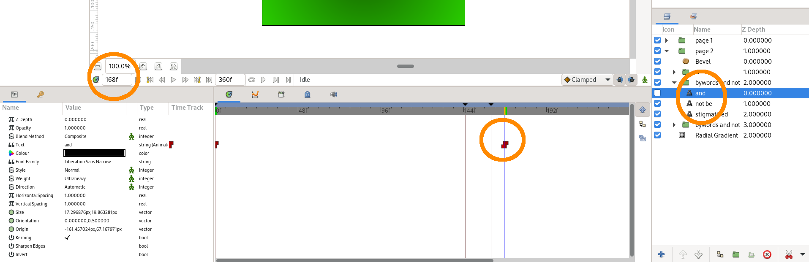
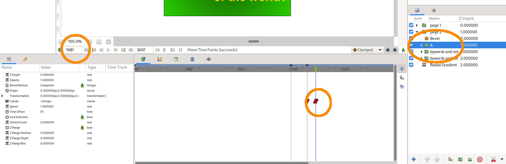

# Bywords
Bywords makes words appear in a Synfig animation as they are spoken, based on a subtitle file.

It's useful in itself, but it also serves as a demonstration of the [Sangfroid](..) library.

# Example

Let's take the first two lines of [How Can I Sing Like a Girl?](https://tmbw.net/wiki/How_Can_I_Sing_Like_A_Girl%3F) by They Might be Giants: 


[The subtitle file](from-test/sing-like-a-girl.srt) used to caption this gif is in [SubRip](http://forum.doom9.org/showthread.php?p=470941#post470941) format (`.srt`) . It looks like this:

```
1
00:00:00,000 --> 00:00:02,600
How

2
00:00:02,700 --> 00:00:06,000
can I sing like a girl

3
00:00:07,000 --> 00:00:10,500
and not be stigmatised

4
00:00:11,000 --> 00:00:14,000
by the rest of the world?
```

Since each line has a half-bar pause, we have split them both into two parts, giving four lines-- each with a start time and an end time.

In practice, it's fine to keep the Bywords subtitle file separate from the one you use for captioning.

Now, we'll combine it with [this animation](from-test/sing-like-a-girl.sif):



Here are the layers of that animation:


Bywords will matches the subtitle lines to these groups based on the text they contain. The names must begin with `"byword"s`, but the rest is arbitrary; the name may simply be `"bywords"`.

Now, suppose we type
```
bywords sing-like-a-girl.sif
```

(We don't have to specify the `.srt` name, as long as it's in the same directory with the same basename. Otherwise, you can specify it as an extra parameter.)

The `.sif` file will be modified in place, giving:



Everything else is kept the same. If you don't trust it to work, make a copy of the `.sif` first-- although you should be backing everything up anyway.

All the lines, except the first, contain multiple words. The pauses between these are weighted by the number of letters in each word. This is because longer words take longer to say. It's only approximate, English spelling being what it is.

If instead we type
```
bywords sing-like-a-girl.sif --letter
```

then we get:



## Text justification

Make sure that the "Orientation" field of each text layer is set to `(0.0, 0.0)`, which means it's measured from the top leftmost point of the layer:



You should do this because Bywords animates the "Text" field of the layer, making the layer wider as it goes. So if the orientation isn't calculated from top left, the text will slide across the screen. Here's an outtake, demonstrating the problem:



This doesn't apply to single-word layers in word-at-a-time mode (or single-letter layers with `--letter`).

You might find it useful to centre the text while you're laying the page out. Then duplicate the layer, and set the "Orientation" layer of the new layer to `(0.0, 0.0)`. Drag the new layer until it's exactly over the old layer, and then delete the old layer.

## Animating the ampersand

The line

> and not be stigmatised

is an example of displaying text which *isn't* directly controlled by Bywords. In the animation, it's shown with the word "and" replaced by an ampersand: 

> & not be stigmatised

It corresponds to the group `"bywords and not"`. This group *does* contain the word "and"-- otherwise Bywords wouldn't match the group-- but the word is set to invisible.

After we've run Bywords once, we can look up where the invisible "and" is set to appear:




